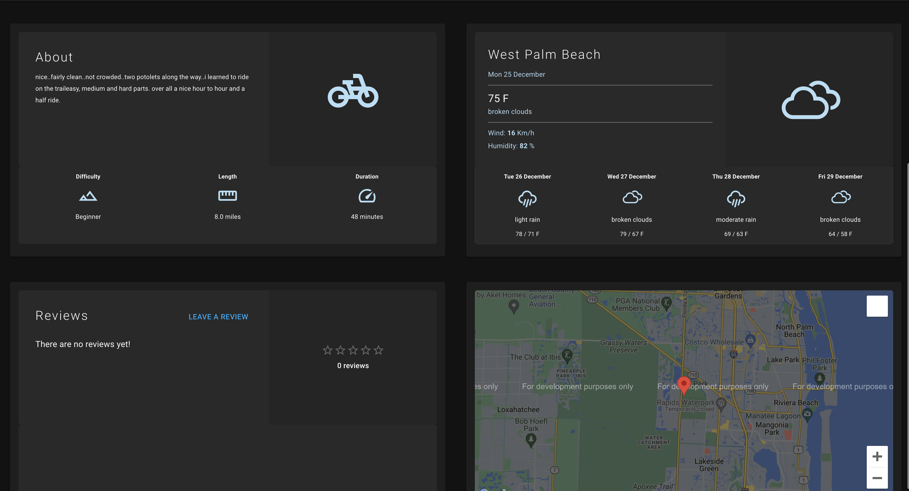

<h1 align="center">TrailBlazers</h1>

<p align="center">Find Hiking/Biking Trails</p>

## Table of Contents

1. [Description](#description)
   - [Built With](#built-with)
2. [Getting Started](#getting-started)
   - [Quick Start](#quick-start)
3. [Features](#features)
   - [Trail Search](#trail-search)
   - [Panels](#panels)
   - [Favorites](#favorites)
4. [Contributors](#contributors)
5. [License](#license)

## **Description**

TrailBlazers is an application to help users find hiking and biking trails.

### Built With

- [Express](https://expressjs.com/)
- [React](https://reactjs.org/)
- [OAuth2](https://oauth.net/2/)
- [Vite](https://vitejs.dev/)

## Getting Started

### Quick Start

1. Clone the TrailBlazers repo.
2. Install dependencies in the root folder and both client/server folders.
3. Start the application from the root directory in the terminal with 
```
$ npm run dev
```
4. Visit http://localhost:5173 

## Features

### Trail Search

Enter a zip code and TrailBlazers will provide you a list of trails closest to you. The search is limited to the 20 closest trails within 50 miles.


### Panels

Each trail has informational panels that will provide you a brief description of the trail, its difficulty, trail length, and estimated time for completion. A 7 day forecast of the trail area is included in the panels.
You can also see what others think about the trail in the reviews section or leave your own review.
A map and directions are available as well.



### Favorites

Login to save your favorite trails and view them at anytime with the favorites menu in the top left.


## Contributors

- Yourui Ruan | [GitHub](https://github.com/YouruiR)
- Esther Nahm | [GitHub](https://github.com/EstherNahm)
- Jenny Schmalz | [GitHub](https://github.com/jennyschmalz)
- Paul Mun | [GitHub](https://github.com/paulbmun)

## License

This product is licensed under the MIT License without restriction.